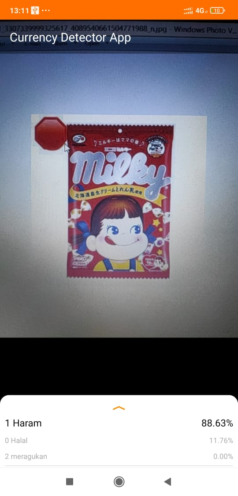
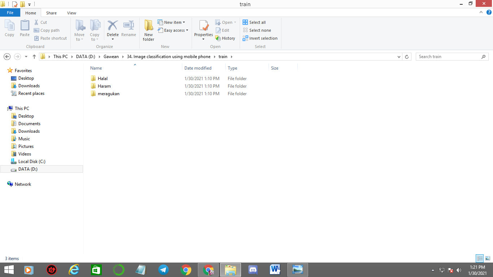
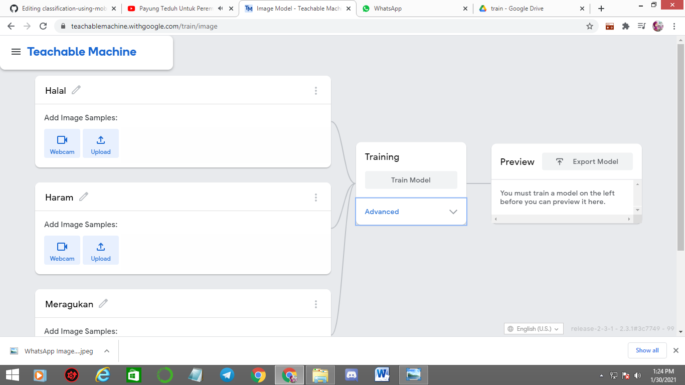
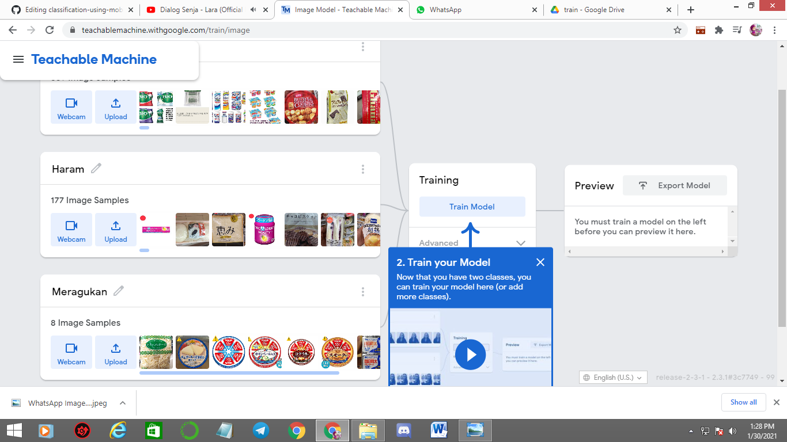
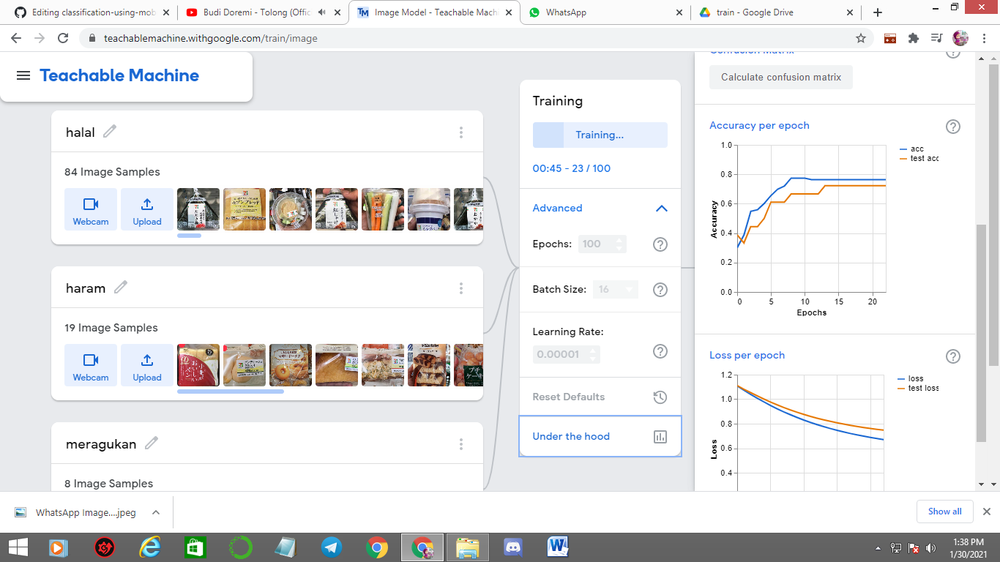
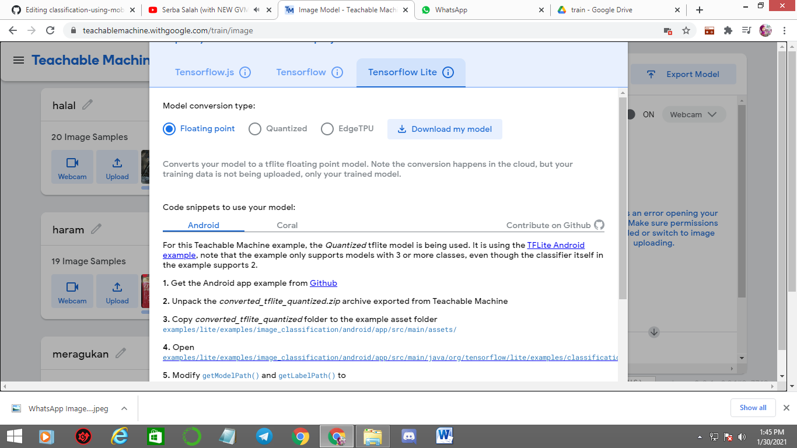

# Training image classification usingTeachable machine

This is an implementation of image classification using Teachable machine learning.

Dataset (Train) : https://drive.google.com/drive/folders/1OZChEqrCwlTKolwT69ExNPnA_CtBkmNo?usp=sharing

The repository includes:
* Using teachable machine learning for image classification 
* Evaluation (confussion matrix) 
* Deploy it to Mobile phone 

# Getting Started
Download this repo and dataset too, if u want use this dataset
* start from making image classification models using teachable machine learning 
* deploy on mobile phone

additional info :
teachable machine is algorithm to make model easy based on web ( https://teachablemachine.withgoogle.com/train/image )

# Training on Your Own Dataset using teachable machine learning

1. Make sure the path like this, and open this link : https://teachablemachine.withgoogle.com/train/image

2. Upload all data to teachable machine, just drag it and drop to upload link 

3. just click train model or u can advance it with ur configuration

4. u can see teh evaluation and ploting, just click "under the hood" 

